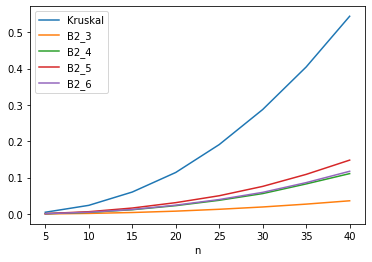

# wallgen
#### Алгоритм генерации лабиринта, основанный на построении стен

## Как это работает?
Описание алгоритмов у меня в [wiki](https://github.com/usermage/wallgen/wiki)

## А эти алгоритмы быстрые?
Ещё какие быстрые :sunglasses:     
    
На графике показано какие же они быстрее относительно алгоритма Краскала для различных n ( **n**x**n** - размер квадратного лабиринта)

## Какие алгоритмы реализованы?
### Краскал
Базовый алгоритм (один из) генерации лабиринтиков

### B2_3
Модификация B2 алгоритма в которой расстановка происходит по порядку обхода массива

### B2_4
Модификация B2 алгоритма в которой стенки вытягиваются в змейку :snake:

### B2_5
Это как B2_4, только змейки :snake::snake::snake: будут короче

### B2_6
Это тоже как B2_4, но :snake: будет расти по определённому правилу

## Круто, а как этим пользоваться?
Просто подключайте файл ***wallgen.py*** и я потом допишу этот раздел :see_no_evil:
#### wallgen.py
Этот файл является основным для подключения файлом ля-ля-ля
#### index.ipynb
Тут находиться весь процесс разработки. Он не структурирован никак, поэтому не заглядывайте туда
