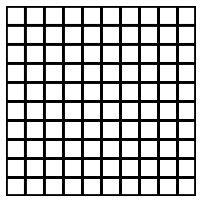

# wallgen
#### Алгоритм генерации лабиринта, основанный на построении стен

## Как это работает?
Описание алгоритмов у меня в [wiki](https://github.com/usermage/wallgen/wiki)

## Какие алгоритмы реализоавны?
### Краскал
Базовый алгоритм (один из) генерации лабиринтиков

### B2_3
Модификация B2 алгоритма в которой расстановка происходит по порядку обхода массива

### B2_4
Модификация B2 алгоритма в которой стенки вытягиваются в змейку :snake:

### B2_5
Это как B2_4, только змейки :snake::snake::snake: будут короче

### B2_6
Это тоже как B2_4, но :snake: будет расти по определённому правилу

